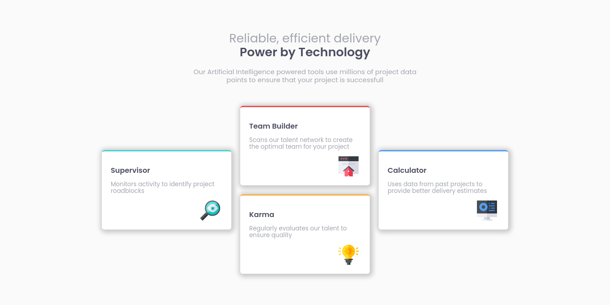
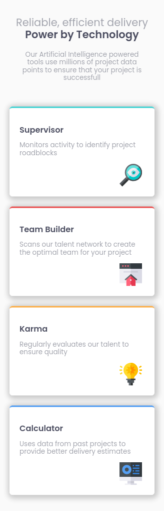

# Frontend Mentor - Solución al Single price component

Esta es una solución al [Desafío del four card feature section master en Frontend Mentor](https://www.frontendmentor.io/challenges/four-card-feature-section-weK1eFYK).

## Tabla de contenido

- [Visión general](#visión-general)
  - [El reto](#el-reto)
  - [Capturas de pantalla](#capturas-de-pantalla)
  - [Enlaces](#enlaces)
- [Mi proceso](#mi-proceso)
  - [Construido con](#construción)
  - [Recursos útiles](#recursos-útiles)
- [Autor](#autor)

## Visión general

### El reto

Los usuarios deben ser capaces de:

- Ver el diseño óptimo en función del tamaño de la pantalla de su dispositivo
- Ver los estados hover de los elementos interactivos

### Capturas de pantalla

- Escritorio

- Móvil

### Enlaces

- URL de la solución (Frontend Mentor): [Solución en Frontend Mentor](https://www.frontendmentor.io/solutions/accessibility-flexbox-gridlayout-responsivedesign-variables-queries-JF76Gmpa7h).
- URL del sitio en vivo: [En vivo](https://boudgnosis.github.io/four-card-feature-section-master/)

## Mi Proceso

### Construción

- HTML semántico
- Variables CSS
- Flexbox
- GRID
- Media queries 
- Responsive desing
- Accesibilidad 

### Recursos útiles

- [MDN Web Docs](https://developer.mozilla.org/es/) - Suelo usar este recurso porque explica muy bien todo además de que tiene una documentación muy amplia.

## Autor

- Codepen - [@boudgnosis](https://codepen.io/boudgnosis)
- Frontend Mentor - [@boudgnosis](https://www.frontendmentor.io/profile/boudgnosis)
- Twitter - [@juan_ariasd](https://twitter.com/juan_ariasd)   
- Dev - [@juan_duque](https://dev.to/juan_duque)
- Linkedink - [juan pablo arias duque](https://www.linkedin.com/in/jpariasduque/)
